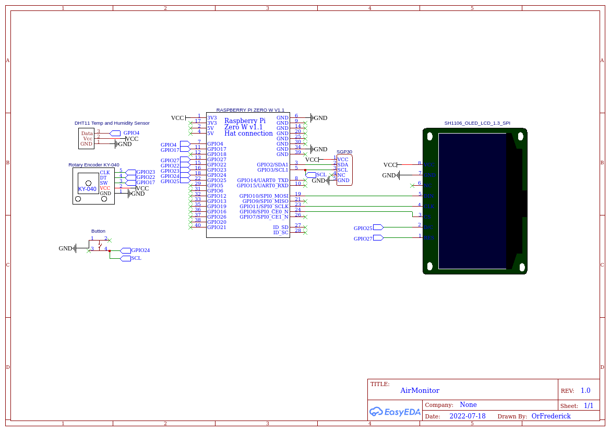

# AirMonitor
This is a project to monitor the air quality.

 

# Parts used
- [Raspberry Pi Zero W](https://www.raspberrypi.com/products/raspberry-pi-zero-w/)
- [SGP30](https://shop.pimoroni.com/products/sgp30-air-quality-sensor-breakout?variant=30924091719763)
- [DHT11](https://components101.com/sensors/dht11-temperature-sensor)
- [Rotary Encoder KY-040](https://components101.com/modules/KY-04-rotary-encoder-pinout-features-datasheet-working-application-alternative)
- [Display](https://www.berrybase.de/1.3-128x64-oled-display-modul-einfarbig-40-blau-41-spi/i2c-interface-vertikale-stiftleiste)
- [Button](https://components101.com/switches/push-button)

 

# Wiring of the components

 

# Getting Started
- Clone this Repo `https://github.com/OrFrederick/AirMonitor.git`
- Install the dependencies `pip install -r requirements.txt`
- [Enable SPI](https://www.raspberrypi-spy.co.uk/2014/08/enabling-the-spi-interface-on-the-raspberry-pi/) on the Raspberry Pi
    ## If you want to connect it to InfluxDB
    - Sign up on [InfluxDB Cloud](https://cloud2.influxdata.com/signup)
    - Create a `.env` file (based on `.env.example`) in the project's root directory and fill in your credentials 
- Start the script with `python3 main.py`